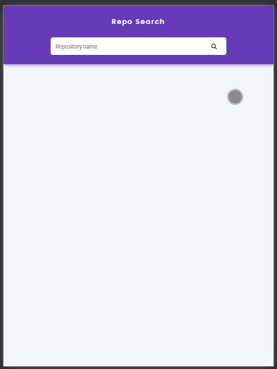
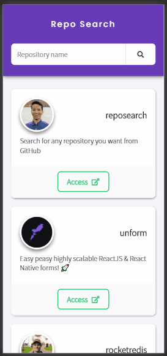

<h1 align="center">Repo Search</h1>

<div align="center">
    
    
    
</div>

---

##  About

This application is a simple **front-end page** that searches for repositories using the GitHub API.

This project was inspired by the Rocketseat study platform.

[Check this out](https://repositorysearch.herokuapp.com/) on your mobile or computer.

## Technologies

- [HTML5](https://developer.mozilla.org/en-US/docs/Web/Guide/HTML/HTML5)
- [CSS3](https://developer.mozilla.org/en-US/docs/Web/CSS)
- [JavaScript](https://developer.mozilla.org/en-US/docs/Web/JavaScript)
- [Yarn](https://yarnpkg.com/)
- [Axios](https://github.com/axios/axios)
- [Babel](https://babeljs.io/)
- [Webpack](https://webpack.js.org/)

Building
---

````
step 1: Get the clone

step 2: Access the project name

step 3: Type yarn dev to start

````
---
Developed by - Renato Souza.